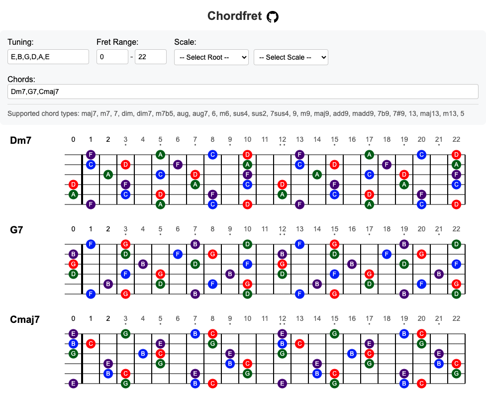

# Chordfret

Chordfret is a web-based tool that visualizes chord positions on any stringed instrument with customizable tuning. It shows all possible positions for each note in the chord, color-coded by their function (root, third, fifth, etc.).



## Live Demo

Visit [https://ashitani.github.io/chordfret/](https://ashitani.github.io/chordfret/) to try it out.


## Features

- Displays all possible positions for each chord
- Supports various chord types (major, minor, 7th, etc.)
- Customizable tuning for any number of strings
- Adjustable fret range display (0-24 frets)
- Scale overlay visualization
- Color-coded notes by chord function
- Supports both sharp and flat notation
- Responsive web interface

## Supported Chord Types

- Major (e.g., C)
- Minor (e.g., Cm)
- Dominant 7th (e.g., C7)
- Major 7th (e.g., Cmaj7)
- Minor 7th (e.g., Cm7)
- Diminished (e.g., Cdim)
- Diminished 7th (e.g., Cdim7)
- Half Diminished (e.g., Cm7b5)
- Augmented (e.g., Caug)
- Augmented 7th (e.g., Caug7)
- 6th (e.g., C6)
- Minor 6th (e.g., Cm6)
- Suspended 4th (e.g., Csus4)
- Suspended 2nd (e.g., Csus2)
- 7sus4 (e.g., C7sus4)
- 9th (e.g., C9)
- Minor 9th (e.g., Cm9)
- Major 9th (e.g., Cmaj9)
- Add9 (e.g., Cadd9)
- Minor add9 (e.g., Cmadd9)
- 7b9 (e.g., C7b9)
- 7#9 (e.g., C7#9)
- 13th (e.g., C13)
- Major 13th (e.g., Cmaj13)
- Minor 13th (e.g., Cm13)
- Power Chord (e.g., C5)
- Slash Chords (e.g., C/G, Dm7/F)

## Usage

1. Enter your instrument's tuning from highest to lowest string (e.g., "E,B,G,D,A,E" for standard guitar tuning)

    You can either:
    - Select from preset tunings (Guitar, Bass, Ukulele)
    - Manually enter tuning in the text box (comma-separated notes from low to high)

    Note: When you select a preset, it will automatically update the display and 
    populate the text box. You can then modify the text for custom tunings if needed.

2. Set the desired fret range (min and max fret positions)
3. Enter a chord progression separated by commas (e.g., "Dm7,G7,Cmaj7")
    - For slash chords, use forward slash: "Dm7/G,C/E,Fmaj7/A"
    - Bass notes are displayed with red outlines
4. Optionally, select a scale to overlay on the fretboard
5. Press Enter to visualize the chords

## Scale Overlay

You can visualize scales alongside chord positions by selecting:
- Scale Root Note (A through G#)
- Scale Type:
  - Minor Pentatonic
  - Major Pentatonic
  - Minor
  - Major

Scale notes are displayed as outlined circles, while chord tones remain solid colored based on their function.

## Color Coding

- Red: Root note
- Indigo: Third
- Dark Green: Fifth
- Blue: Seventh
- Purple: Ninth
- Brown: Other extensions (11th, 13th)

## Development

The application is built using vanilla JavaScript, HTML, and CSS, with no external dependencies.

Development was assisted by AI pair programming using Anthropic's Claude-3.5-Sonnet via Cursor.
This collaborative approach helped in rapid prototyping and implementation of features while
maintaining clean and maintainable code.

## Installation

To run locally:

1. Clone the repository
   ```bash
   git clone https://github.com/yourusername/chordfret.git
   ```

2. Open `index.html` in your web browser

Or simply visit the live demo link above.

## Contributing

1. Fork the repository
2. Create your feature branch (`git checkout -b feature/amazing-feature`)
3. Commit your changes (`git commit -m 'Add some amazing feature'`)
4. Push to the branch (`git push origin feature/amazing-feature`)
5. Open a Pull Request 

## License

MIT License
